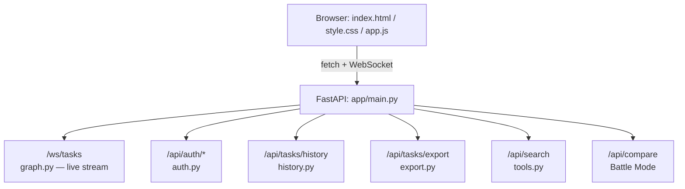
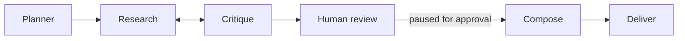

<div align="center">

# 🚀 TaskPilot

### Autonomous Research Agent with a Premium Web UI

[](https://www.python.org/)
[](https://fastapi.tiangolo.com/)
[](https://langchain-ai.github.io/langgraph/)
[](LICENSE)

[](https://github.com/Tejeshyewale/Taskpilot/stargazers)
[](https://github.com/Tejeshyewale/Taskpilot/network/members)
[](https://github.com/Tejeshyewale/Taskpilot/issues)
[](https://github.com/Tejeshyewale/Taskpilot/commits)

Give it a goal — it plans, researches, self-critiques, pauses for your approval,
and delivers a polished report. Real streaming. Real accounts. Real tools.

[Features](#-features) • [Demo](#-architecture) • [Quick start](#-quick-start) • [Structure](#-project-structure) • [Security](#-security) • [Roadmap](#%EF%B8%8F-roadmap)

</div>

---

## 📖 About

TaskPilot is a production-oriented autonomous research agent. It plans a goal into subquestions, researches each one with the right tool (web search or calculator), self-critiques its own progress, pauses for human approval, and writes a polished final report — exportable as DOCX or PDF, in the language of your choice.

Built with **LangGraph** for agent orchestration, **FastAPI** for native WebSocket streaming, and a hand-built HTML/CSS/JS frontend — no heavy frontend framework needed.

## ✨ Features

| | |
|---|---|
| 🧠 **Real LLM + real web search** | Gemini / Claude / Groq for reasoning, free DuckDuckGo (or optional Tavily) for search — no mock mode |
| 🛠️ **Multi-tool agent** | Subquestions route to a calculator or web-search tool based on what they actually need |
| ⚡ **Real-time streaming** | Progress stepper reflects the agent's *actual* current step, pushed live over WebSocket |
| 🔐 **Accounts** | Salted, hashed passwords, rate-limited login, expiring sessions — guests can skip login entirely |
| 📄 **DOCX / PDF export** | Clean, professional formatted documents, not a JSON dump |
| 🌐 **Multi-language reports** | English, Hindi, Spanish, French, German, Japanese |
| 📧 **Email notifications** | Optional, sent when a report finishes |
| ⚔️ **Battle Mode** | Instant side-by-side comparison of two topics |
| 👍 **Feedback** | Per-report rating, aggregated for a usefulness signal |
| 🌗 **Light/dark theme** | Toggle from the sidebar |
| 📱 **Fully responsive** | Mobile-friendly slide-in sidebar navigation |

## 🏗️ Architecture



**Agent graph:**



- **Multi-tool routing** — `research` picks `calculator` for pure-arithmetic subquestions, `web_search` otherwise
- Hard iteration cap prevents infinite loops
- Per-subquestion retry-then-give-up prevents one bad search from stalling everything
- State persists to SQLite — a task survives a full process restart
- Every node execution is logged and streamed live over WebSocket

## 🚀 Quick start

```bash
# 1. Install
pip install -r requirements.txt

# 2. Configure
cp .env.example .env
# then set ONE LLM key inside .env:
#   GEMINI_API_KEY=...        or
#   ANTHROPIC_API_KEY=...     or
#   GROQ_API_KEY=...          (free tier: console.groq.com/keys)

# 3. Run
uvicorn app.main:app --reload --port 8000
```

Open **http://localhost:8000** — sign up, log in, or skip and use as a guest.

### 🐳 Docker

```bash
docker compose up --build
```

## 📁 Project structure

```
taskpilot/
├── app/
│   ├── state.py       # state schema + reducers
│   ├── llm.py          # LLM client (Gemini/Anthropic/Groq)
│   ├── tools.py         # web_search + calculator + tool router
│   ├── auth.py            # accounts — hashed passwords, sessions, rate-limiting
│   ├── notify.py            # email notifications
│   ├── tracing.py             # observability (JSONL trace log)
│   ├── graph.py                 # the agent graph
│   ├── export.py                  # DOCX + PDF generation
│   ├── history.py                   # user-scoped task history + feedback
│   └── main.py                        # FastAPI backend
├── static/
│   ├── index.html      # single-page app shell
│   ├── style.css         # dark/light theme, mobile responsive
│   ├── app.js               # frontend logic + WebSocket client
│   └── favicon.svg            # logo mark
├── tests/                       # evaluation harness
├── requirements.txt
├── Dockerfile / docker-compose.yml
└── .env.example
```

## 🔒 Security

- 🔑 Passwords salted and hashed with **PBKDF2** (100,000 iterations) — never stored in plaintext
- ⏳ Session tokens **expire after 14 days**
- 🚫 Login **rate-limited** (5 attempts / 5 min per account) against brute-force
- 🌍 **CORS configurable** via `CORS_ORIGINS` for production deployments

## 🗺️ Roadmap

- [ ] Swap the heuristic calculator router for an LLM-based tool-selection call
- [ ] Add a third tool (code execution, file I/O)
- [ ] Move history/auth from JSON files to Postgres for concurrent multi-user scale
- [ ] Add password reset / email verification

## 🤝 Contributing

Pull requests are welcome. For major changes, open an issue first to discuss what you'd like to change.

## 📄 License

Distributed under the MIT License. See [LICENSE](LICENSE) for details.

---

<div align="center">

Made with  by [Tejeshyewale](https://github.com/Tejeshyewale)

⭐ Star this repo if you find it useful!!


